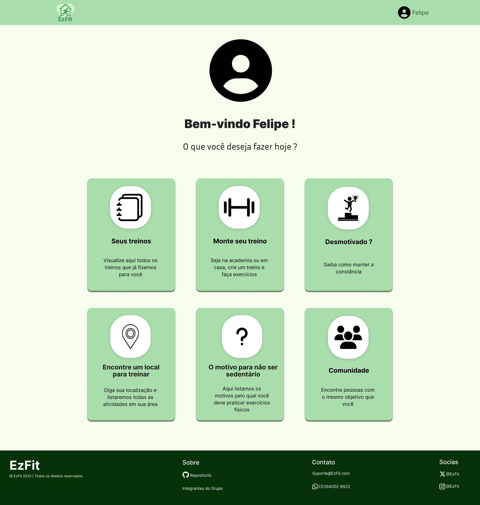
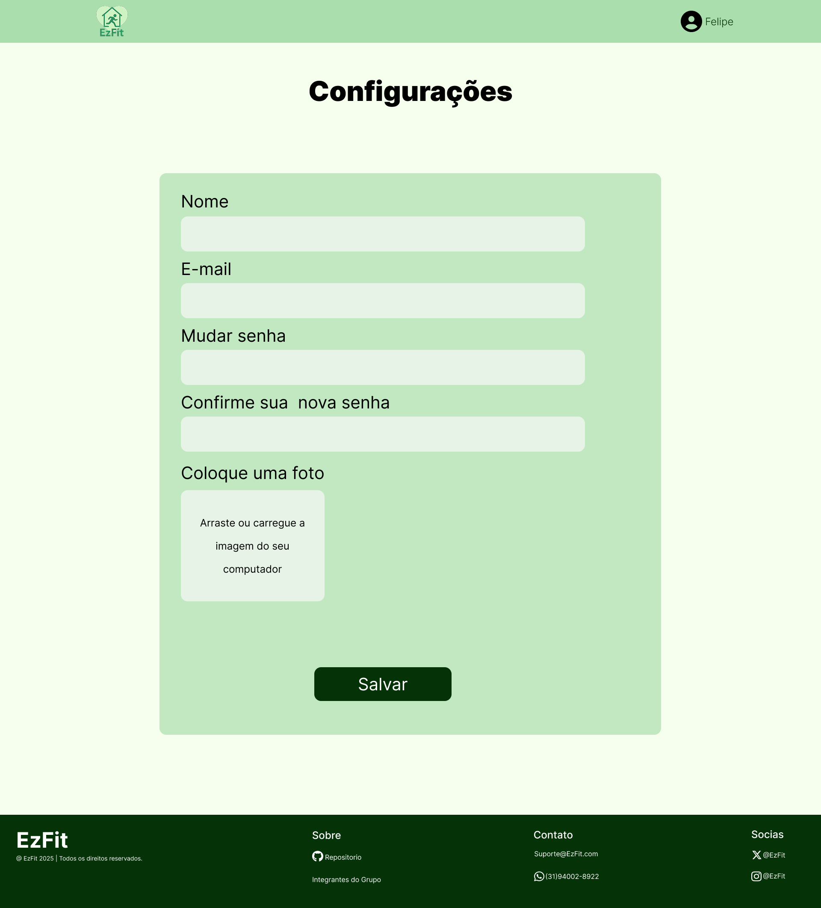
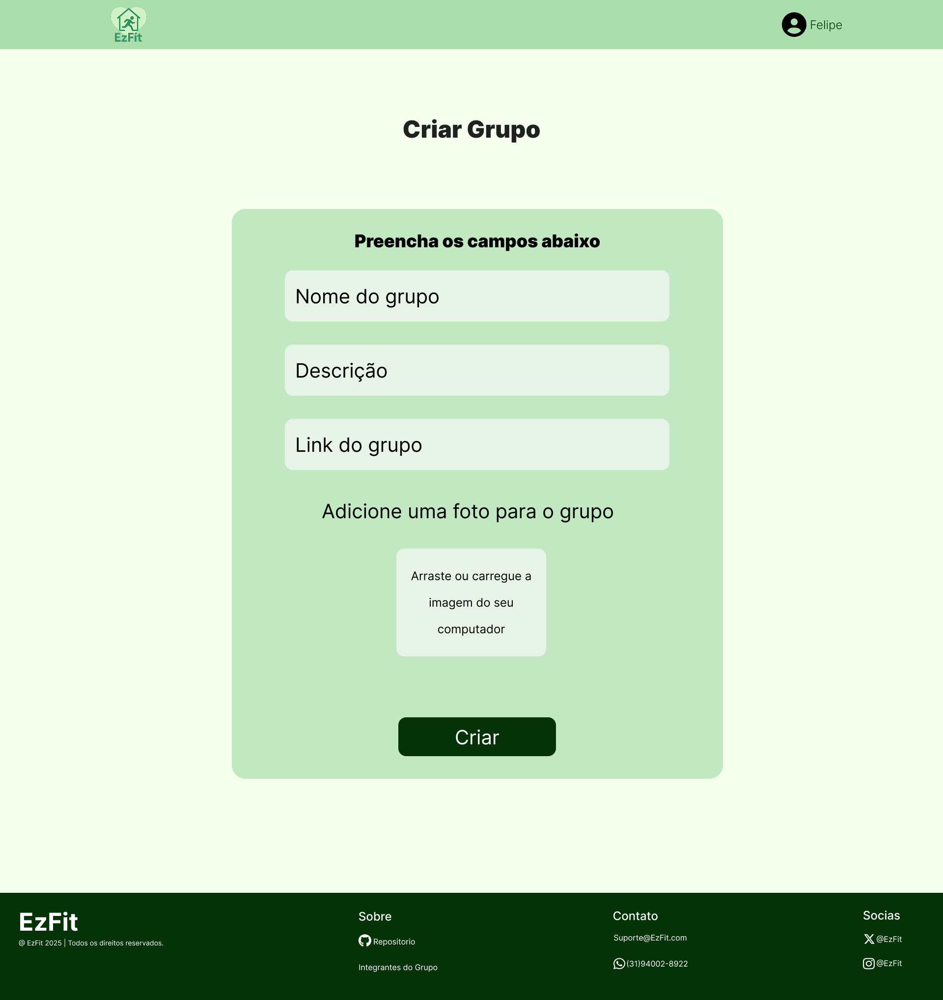
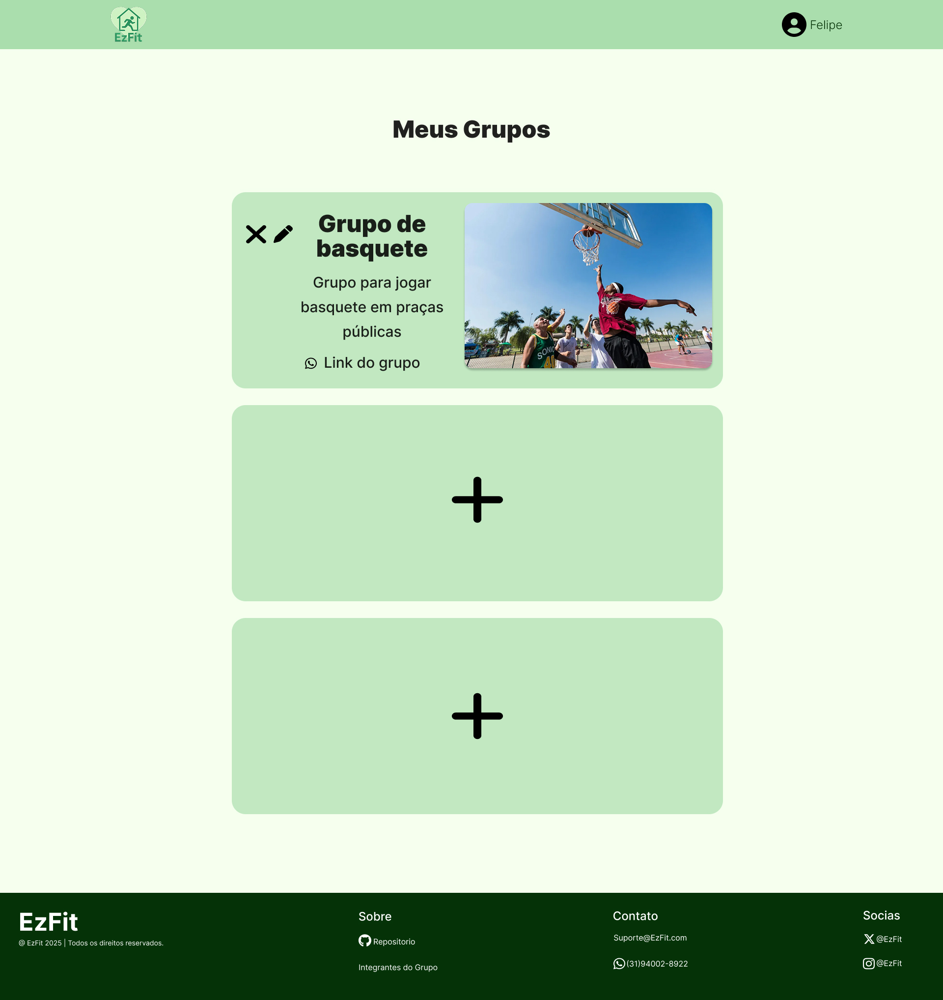
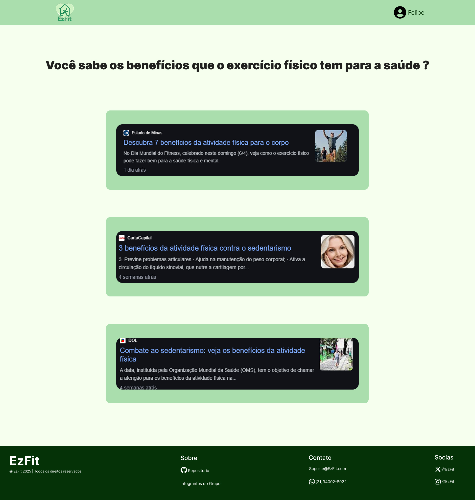

# Introdução

Informações básicas do projeto.

* **Projeto:** EzFit
* **Repositório GitHub:** [Repositório EzFit](https://github.com/ICEI-PUC-Minas-PPLES-TI/plf-es-2025-1-ti1-0385100-ezfit.git)
* **Membros da equipe:**

  * [André Kirst](https://github.com/Aklages)
  * Bruno Henrique
  * Diego Volponi
  * Lucca Maximo
  * Matheus Henrique
  * [Victor Amaral](https://github.com/Vamarall)


A documentação do projeto é estruturada da seguinte forma:

1. Introdução
2. Contexto
3. Product Discovery
4. Product Design
5. Metodologia
6. Solução
7. Referências Bibliográficas

✅ [Documentação de Design Thinking (MIRO)](files/processo-dt.pdf)

# Contexto

Detalhes sobre o espaço de problema, os objetivos do projeto, sua justificativa e público-alvo.

## Problema

O sedentarismo é um problema crescente na sociedade moderna, impulsionado por estilos de vida cada vez mais digitais, rotinas estressantes e a falta de motivação para a prática regular de atividades físicas. Embora muitas pessoas desejem adotar hábitos mais saudáveis, fatores como a escassez de tempo e a ausência de estímulos dificultam o início e a manutenção de uma rotina ativa. Esse cenário contribui para o aumento de problemas de saúde física e mental, tornando urgente a busca por soluções que incentivem mudanças de comportamento.

## Objetivos

O objetivo geral deste trabalho é desenvolver uma aplicação web que auxilie jovens adultos na superação do sedentarismo, oferecendo recomendações personalizadas de atividades físicas com base nas necessidades e preferências individuais dos usuários.

Como objetivos específicos, destacam-se:

* Implementar um sistema de recomendação de atividades físicas considerando fatores como distância, tempo disponível e objetivos pessoais de saúde ou desempenho.
* Propor funcionalidades que incentivem o engajamento do usuário, como vídeos motivacionais, informações científicas sobre os impactos do sedentarismo.
* Disponibilizar a criação e participação de comunidades/grupos de interesse com foco em práticas esportivas coletivas.

## Justificativa

A motivação para a criação do EzFit surgiu a partir da observação da realidade de muitos
jovens adultos, que se encontram desmotivados ou sem tempo. Diversos estudos e levantamentos mostram
as graves consequências do sedentarismo, como obesidade, ansiedade e baixa produtividade.

O grupo realizou entrevistas com pessoas sedentárias que apontaram a falta de tempo e a falta de motivação como as principais
barreiras para iniciar a pratica de exercícios físicos.

Dessa forma, o EzFit se justifica como uma solução inovadora e relevante para esse público,
utilizando recursos tecnológicos para recomendar exercícios físicos de acordo com a disponibilidade do usuário.

## Público-Alvo

O público-alvo da aplicação é composto por jovens adultos, geralmente entre 18 e 25 anos, que desejam adotar hábitos de vida mais saudáveis, mas enfrentam dificuldades para iniciar ou manter uma rotina de atividades físicas. Entre os principais desafios estão a falta de tempo, a ausência de motivação e o desconhecimento sobre quais práticas são mais adequadas para seu perfil e objetivos.

Esses usuários possuem, em geral, familiaridade com tecnologia, estando habituados ao uso de smartphones, redes sociais e plataformas digitais em geral. Por isso, espera-se que tenham facilidade em interagir com a aplicação proposta, principalmente se ela oferecer uma navegação intuitiva e recursos que promovam engajamento.

Exemplos de usuários usando a história de usuário + persona:
Felipe, 22 anos, estagiário, deseja encontrar tempo e motivação para praticar exercícios físicos.
Pedro, 25 anos, Analista financeiro, deseja praticar exercícios físicos para ficar em forma.

# Product Discovery

## Etapa de Entendimento
### Matriz CSD:


### Mapa de Stakeholders:


### Entrevistas qualitativas:


### Highlights de pesquisa:


## Etapa de Definição

### Personas


# Product Design

Nesse momento, vamos transformar os insights e validações obtidos em soluções tangíveis e utilizáveis. Essa fase envolve a definição de uma proposta de valor, detalhando a prioridade de cada ideia e a consequente criação de wireframes, mockups e protótipos de alta fidelidade, que detalham a interface e a experiência do usuário.

## Histórias de Usuários

Com base na análise das personas foram identificadas as seguintes histórias de usuários:

| EU COMO...`PERSONA`     | QUERO/PRECISO ...`FUNCIONALIDADE`              | PARA ...`MOTIVO/VALOR`                       |
| ---------------------   | ------------------------------------------     | --------------------------------------       |
| Amanda                  | Praticar atividades em grupo                   | Continuar tendo interação social             |
| Pedro                   | Praticar alguma atividade física               | Perder a barriga e me manter em forma        |
| Felipe                  | Encontrar tempo e motivação                    | Ter uma boa saúde                            |
| Trabalhador CLT 6x1     | Encontrar motivação para exercitar             | Melhorar a minha saúde                       |
| Estudante e estagiário  | Encontrar tempo para exercitar                 | Melhorar a minha saúde                       |
| Jovem diabético         | Manter uma regularidade nas atividades físicas | Controlar minha saúde e manter meu bem estar |
| Estudante universitário | começar uma atividade física                   | Melhorar meus rendimentos nos estudos        |
| Jovem acima do peso     | Fazer atividades físicas                       | Perder peso e melhorar minha autoestima      |
| Jovem adulto            | Incluir exercício físico na rotina             | Evitar doenças hereditárias                  |

## Proposta de Valor

##### Proposta para Persona FELIPE


##### Proposta para Persona AMANDA


##### Proposta para Persona PEDRO


## Requisitos

As tabelas que se seguem apresentam os requisitos funcionais e não funcionais que detalham o escopo do projeto.

### Requisitos Funcionais

| ID     | Descrição do Requisito                                   | Prioridade |
| ------ | ---------------------------------------------------------- | ---------- |
| RF-001 | A aplicação deve conter uma área de registro | ALTA       |
| RF-002 | A aplicação deve conter propostas de exercícios físicos | ALTA     |
| RF-003 | A aplicação deve conter uma opção de criar rotinas de atividades físicas | ALTA     |
| RF-004 | A aplicação deve conter uma opção de organizar/criar rotina das atividades físicas do usuário | ALTA     |
| RF-005 | A aplicação deve conter um filtro baseado em tempo disponível e localização próxima | ALTA     |
| RF-006 | A aplicação deve conter informações científicas sobre sedentarismo | MÉDIA     |
| RF-007 | A aplicação deve conter uma aba de comunidade, para os usuarios interagirem em grupos de interesse | MÉDIA     |
| RF-008 | A aplicação deve recomendar treinos baseados nas preferência. (Treino em casa, treino na academia) | MÉDIA     |
| RF-009 | A aplicação deve recomendar vídeos motivacionais ou artigos com o intuito de evitar a desmotivação para a prática de atividades fisicas  | MÉDIA     |
| RF-010 | O sistema deve gerar um arquivo csv sobre o treino recomendado  | MÉDIA     |
| RF-011 | A aplicação deve conter uma opção de adicionar amigos | BAIXA     |
| RF-012 | A aplicação deve conter uma opção de olhar perfis de outras pessoas | BAIXA     |

### Requisitos não Funcionais

| ID      | Descrição do Requisito                                                              | Prioridade |
| ------- | ------------------------------------------------------------------------------------- | ---------- |
| RNF-001 | A aplicação será desenvolvida com html, css e bootstrap. | ALTA     |
| RNF-002 | O site será responsível e terá uma visualização adequada para diferentes dispositivos.          | ALTA      |
| RNF-003 | O site deve estar de acordo com as normas da LGPD          | ALTA      |
| RNF-004 | O site deve ter suporte para mais de um idioma          | BAIXA      |
| RNF-005 | O site terá modo noturno          | BAIXA      |

## Projeto de Interface

Artefatos relacionados com a interface e a interacão do usuário na proposta de solução.

### Wireframes

Estes são os protótipos de telas do sistema.

##### TELA HOMEPAGE

Tela inicial, para convencer o usuário a criar seu cadastro no site.


##### TELA REGISTRO

Tela para criar cadastro no site.


##### TELA LOGIN

Tela para logar no site.


##### TELA USUARIO_LOGADO

Tela principal do usuário, com os cards que leva as outras telas com as funcionalidades principais.



##### TELA CONFIGURAÇÕES

Tela para configurar sua conta.



##### TELA MONTAR_TREINO

Tela para montar o treino do usuário usando nosso algoritmo.


##### TELA TREINOS

Tela para visualizar os treinos.


##### TELA LOCALIZAÇÃO

Tela para encontrar localizações com possibilidade de praticar exercícios físicos.


##### TELA COMUNIDADE

Tela para encontrar grupos de interesse.


##### TELA CRIAR_GRUPO

Tela para criar grupos.



##### TELA VER_GRUPOS

Tela para visualizar os grupos criados pelo usuário.



##### TELA MOTIVAÇÃO

Tela com conteúdos para motivar o usuário.


##### TELA CONSCIENTIZAÇÃO

Tela com conteúdos para conscientizar o usuário.



### User Flow


### Protótipo Interativo

[Protótipo Interativo EzFit](https://www.figma.com/proto/q5gZfvlqbbKevA76tNFEP8/EzFit?node-id=0-1&t=im2LzitrSZq5L4yf-1)

# Metodologia

Detalhes sobre a organização do grupo e o ferramental empregado.

## Ferramentas

Relação de ferramentas empregadas pelo grupo durante o projeto.

| Ambiente                    | Plataforma | Link de acesso                                     |
| --------------------------- | ---------- | -------------------------------------------------- |
| Processo de Design Thinking | Miro       | https://miro.com/app/board/uXjVIRySsuU=/?share_link_id=309987947790  |
| Repositório de código       | GitHub     | https://github.com/ICEI-PUC-Minas-PPLES-TI/plf-es-2025-1-ti1-0385100-ezfit.git|
| Hospedagem do site          | Replit     | https://replit.com/@ak1lages/EzFit |
| Protótipo Interativo        | Figma      | https://www.figma.com/proto/q5gZfvlqbbKevA76tNFEP8/EzFit?node-id=0-1&t=im2LzitrSZq5L4yf-1   |
| Editor de código            | Vscode     | https://code.visualstudio.com/  |
| Comunicação                 | Discord    | https://discord.com/  |
| Ferramenta método ágil      | Miro       | https://miro.com/app/board/uXjVISTy7Qw=/?share_link_id=616800660472  |

## Gerenciamento do Projeto

Divisão de papéis no grupo e apresentação da estrutura da ferramenta de controle de tarefas (Kanban).


# Solução Implementada

Esta seção apresenta todos os detalhes da solução criada no projeto.

## Vídeo do Projeto

O vídeo a seguir traz uma apresentação do problema que a equipe está tratando e a proposta de solução. ⚠️ EXEMPLO ⚠️

[](https://www.youtube.com/embed/70gGoFyGeqQ)

> ⚠️ **APAGUE ESSA PARTE ANTES DE ENTREGAR SEU TRABALHO**
>
> O video de apresentação é voltado para que o público externo possa conhecer a solução. O formato é livre, sendo importante que seja apresentado o problema e a solução numa linguagem descomplicada e direta.
>
> Inclua um link para o vídeo do projeto.

## Funcionalidades

Esta seção apresenta as funcionalidades da solução

##### Funcionalidade 1 - Sugerir Treinos

Apresentação

* **Estrutura de dados:** [Treinos](#estrutura-de-dados---treinos)
* **Instruções de acesso:**
  * Abra o site e faça cadastro
  * Clique no card de meus treinos
* **Tela da funcionalidade**:


##### Funcionalidade 2 - Apresentar Treinos

Apresentação

* **Estrutura de dados:** [Treinos](#estrutura-de-dados---treinos)
* **Instruções de acesso:**
  * Abra o site e faça cadastro
  * Clique no card de meus treinos
  * Caso não tenha um treino associado ao usuario, escolha um na funcionalidade de sugerir treino para ser redirecionado para a tela de apresentar treinos
* **Tela da funcionalidade**:


##### Funcionalidade 3 - Econtrar um local

Apresentação

* **Estrutura de dados:** [Locais](#estrutura-de-dados---locais)
* **Instruções de acesso:**
  * Abra o site e faça cadastro
  * Clique no card de encontrar um local
* **Tela da funcionalidade**:


##### Funcionalidade 4 - Apresentar videos motivacionais

Apresentação

* **Estrutura de dados:** [Conteudos](#estrutura-de-dados---conteudos)
* **Instruções de acesso:**
  * Abra o site e faça cadastro
  * Clique no card de vídeos motivacionais
* **Tela da funcionalidade**:


##### Funcionalidade 5 - Apresentar informações científicas

Apresentação

* **Estrutura de dados:** [Conteudos](#estrutura-de-dados---conteudos)
* **Instruções de acesso:**
  * Abra o site e faça cadastro
  * Clique no card de informações científicas
* **Tela da funcionalidade**:


##### Funcionalidade 6 - Apresentar comunidades

Apresentação

* **Estrutura de dados:** [Grupos](#estrutura-de-dados---grupos)
* **Instruções de acesso:**
  * Abra o site e faça cadastro
  * Clique no card de comunidades
* **Tela da funcionalidade**:


##### Funcionalidade 7 - Crud comunidade

Apresentação

* **Estrutura de dados:** [Grupos](#estrutura-de-dados---grupos)
* **Instruções de acesso:**
  * Abra o site e faça cadastro
  * Clique no card de comunidades
  * Clique no botão de criar/ver grupos
* **Tela da funcionalidade**:


##### Funcionalidade 8 - Apresentar Favoritos

Apresentação

* **Estrutura de dados:** [Favoritos](#estrutura-de-dados---favoritos)
* **Instruções de acesso:**
  * Abra o site e faça cadastro
  * Clique no card de favoritos
* **Tela da funcionalidade**:


##### Funcionalidade 9 - Crud Conteudos

Apresentação

* **Estrutura de dados:** [Conteudos](#estrutura-de-dados---conteudos)
* **Instruções de acesso:**
  * Abra o site e faça cadastro com uma conta com permissao de administrador(user: adm, senha: 123)
  * Clique no card de Cadastrar Conteudos
* **Tela da funcionalidade**:


##### Funcionalidade 10 - Crud Exercicios

Apresentação

* **Estrutura de dados:** [Exercicios](#estrutura-de-dados---exercicios)
* **Instruções de acesso:**
  * Abra o site e faça cadastro com uma conta com permissao de administrador(user: adm, senha: 123)
  * Clique no card de Cadastrar Exercicios
* **Tela da funcionalidade**:


##### Funcionalidade 11 - Crud Treinos

Apresentação

* **Estrutura de dados:** [Treinos](#estrutura-de-dados---treinos)
* **Instruções de acesso:**
  * Abra o site e faça cadastro com uma conta com permissao de administrador(user: adm, senha: 123)
  * Clique no card de Cadastrar Treinos
* **Tela da funcionalidade**:


##### Funcionalidade 12 - Crud Locais

Apresentação

* **Estrutura de dados:** [Locais](#estrutura-de-dados---locais)
* **Instruções de acesso:**
  * Abra o site e faça cadastro com uma conta com permissao de administrador(user: adm, senha: 123)
  * Clique no card de Cadastrar Locais
* **Tela da funcionalidade**:


## Estruturas de Dados

Descrição das estruturas de dados utilizadas na solução com exemplos no formato JSON

##### Estrutura de Dados - Usuarios

Usuarios da aplicação

```json
  {
     "id": 1,
     "login": "adm",
     "senha": "123",
     "nome": "Administrador do Sistema",
     "email": "adm@ezfit.com",
     "treino": 0,
     "adm": true
  }
  
```

##### Estrutura de Dados - Exercicios

Exercicios usados nos treinos

```json
  {
    "id": 1,
    "nome": "Polichinelo",
    "duracao_min": 5,
    "repeticoes": 20
  }
```

##### Estrutura de Dados - Treinos

Treinos para os usuarios

```json
  {
    "id": 1,
    "objetivo": "cardio",
    "dias": 3,
    "tempo_livre_m": 30,
    "local": "casa"
  }
```

##### Estrutura de Dados - Treinos_exercicios

Entidade relacional de treinos e exercicios

```json
  {
    "id": 1,
    "treinoId": 1,
    "exercicioId": 1
  }
```

##### Estrutura de Dados - Locais

Localizações usadas na tela de encontrar locais

```json
  {
    "id": 1,
    "nome": "Academia Smart Fit - Avenida Prudente de Morais",
    "tipo": "Academia",
    "link": "https://www.smartfit.com.br/academias/avenida-prudente-de-morais",
    "latitude": "-19.940607825663637",
    "longitude": "-43.9478355100661"
  }
```

##### Estrutura de Dados - Grupos

Grupos disponiveis e criados pelos usuarios

```json
  {
    "id": 1,
    "id_usuario": 1,
    "categoria": "basquete",
    "titulo": "Basquete BH",
    "descricao": "Grupo para quem quer praticar basquete em bh no bairro castelo",
    "imagem": "../public/assets/images/",
    "link": "https://chat.whatsapp.com/DiMIZNIg6qfKGJtf1DflaR"
  }
```

##### Estrutura de Dados - Conteudos

Conteudos como artigos e videos

```json
  {
    "id": 1,
    "titulo": "Qualquer prática de atividade física é benéfica para o corpo humano",
    "descricao": "Entenda por que o corpo humano precisa de movimento e como pequenas ações diárias já fazem diferença.",
    "categoria": "artigo",
    "imagem": "https://institutoagf.com.br/wp-content/uploads/2023/03/preguica-1.jpg",
    "link": "https://jornal.usp.br/radio-usp/qualquer-pratica-de-atividade-fisica-e-benefica-para-o-corpo-humano/"
  },
  {
    "id": 7,
    "titulo": "Mexa-se contra o sedentarismo",
    "descricao": "",
    "categoria": "video",
    "imagem": "",
    "link": "https://www.youtube.com/embed/M6mJLvSAXwg"
  }
```

##### Estrutura de Dados - Favoritos

Entidade para guardar os itens favoritados pelo usuario

```json
  {
    "usuarioId": 4,
    "favorito": 1,
    "categoria": "local",
    "id": 1
  }
```

## Módulos e APIs

Esta seção apresenta os módulos e APIs utilizados na solução

**APIs**:

* Mapbox - [https://www.mapbox.com/](https://www.mapbox.com/)
* Viacep - [https://viacep.com.br/](https://viacep.com.br/) 

**Images**:

* Unsplash - [https://unsplash.com/](https://unsplash.com/)
* Freepick - [https://br.freepik.com/](https://br.freepik.com/)

**Videos**:

* Youtube - [https://www.youtube.com/](https://www.youtube.com/)

**Fonts:**

* Font Awesome - [https://fontawesome.com/](https://fontawesome.com/)
* Google Fonts - [https://fonts.google.com/](https://fonts.google.com/)

**Scripts:**

* jQuery - [http://www.jquery.com/](http://www.jquery.com/)
* Bootstrap 4 e 5 - [http://getbootstrap.com/](http://getbootstrap.com/)
* PooperJs - [https://popper.js.org/docs/v2/](https://popper.js.org/docs/v2/)

**Módulos:**

* Crud Contatos - [https://replit.com/@rommelpuc/Cadastro-de-Contatos-localStorage?v=1#app.js](https://replit.com/@rommelpuc/Cadastro-de-Contatos-localStorage?v=1#app.js)
* Login App - [https://replit.com/@rommelpuc/LoginApp?v=1#index.html](https://replit.com/@rommelpuc/LoginApp?v=1#index.html)

# Referências

As referências utilizadas no trabalho foram:

* SOBRENOME, Nome do autor. Título da obra. 8. ed. Cidade: Editora, 2000. 287 p ⚠️ EXEMPLO ⚠️

> ⚠️ **APAGUE ESSA PARTE ANTES DE ENTREGAR SEU TRABALHO**
>
> Inclua todas as referências (livros, artigos, sites, etc) utilizados no desenvolvimento do trabalho.
>
> **Orientações**:
>
> - [Formato ABNT](https://www.normastecnicas.com/abnt/trabalhos-academicos/referencias/)
> - [Referências Bibliográficas da ABNT](https://comunidade.rockcontent.com/referencia-bibliografica-abnt/)
